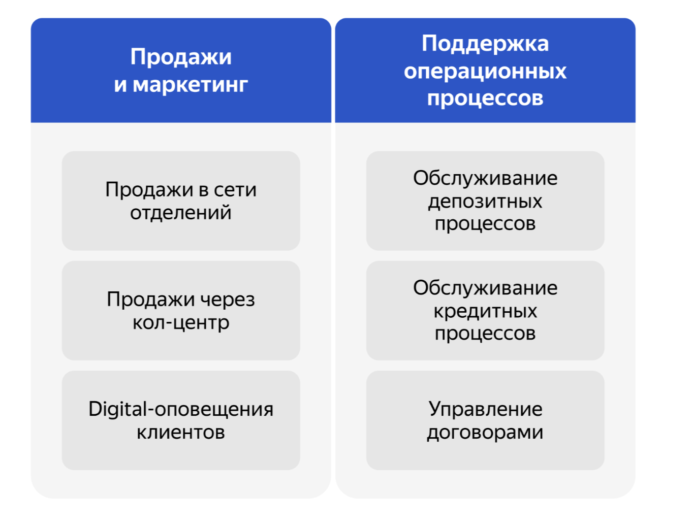

# Задание 1. Карта IT-ландшафта и схема интеграции приложений

Команде цифровой трансформации необходимо определить, что сейчас мешает сделать депозиты и накопительные счета полностью цифровым продуктом, который будет доступен в интернет-банке.
Владелец продукта уже просчитал бюджет бизнес-модели и частично проанализировал процессы. Текущая модель предполагает большие издержки на процессы, в которых задействованы сотрудники бэк-офиса. Их процесс не позволяет мгновенно открывать депозиты.

## Процесс открытия депозита

Сейчас процесс выглядит так:

1. Клиент может подать заявку на открытие депозита только в отделении. Сотрудники отдела кредитования вручную считают ставки в Excel-файле на основе ставки рефинансирования Центробанка. Они анализируют текущее количество выданных кредитов и депозитов в банке. Итоговая ставка по депозитам зависит от уровня кредитного риска банка. Она обновляется ежедневно — эти показатели передаются в бэк-офис каждый день по почте Excel-файлом.

2. Если до своего визита клиент позвонил в кол-центр, чтобы уточнить детали открытия депозита, то сотрудник кол-центра заводит обращение в своей системе. Оно передаётся в АБС. Сотрудники бэк-офиса отдельно обрабатывают заявки из кол-центра в АБС, чтобы определить ставки для таких клиентов заранее. Если ставка определена, то сотрудник обрабатывает заявку в АБС и указывает там ставку. После этого АБС отправляет СМС-оповещение клиенту о том, что он может получить депозит под указанную ставку, — для этого надо прийти в отделение.

3. Если клиент приходит в отделение без предварительного звонка, то его заявку нельзя обработать заранее. В этом случае, чтобы озвучить клиенту ставку депозита, сотрудник отделения пишет письмо сотруднику бэк-офиса.

4. Если у клиента достаточно много денег на счетах, ему могут согласовать специальные ставки. Чтобы их определить, сотрудники бэк-офиса обращаются в отдел кредитования. Сотрудник кредитования анализирует текущий уровень кредитного риска для банка в своём разделе АБС относительно этого клиента и передаёт данные в письме. Эти данные менеджер депозитов добавляет в Excel-файл и вычисляет на их основе ставку. Он посылает её ответным письмом сотруднику фронт-офиса.

5. Процесс выглядит так, потому что сотрудники депозитов и сотрудники кредитов не должны иметь доступа к данным друг друга по требованиям безопасности. Когда клиент узнаёт ставку и подтверждает открытие депозита, сотрудник фронт-офиса создаёт депозит в АБС и выдаёт клиенту необходимые документы. Когда документы подписаны, сотрудник загружает их в АБС.

Пока проходят все этапы согласования, клиент ожидает в отделении. Обычно всё происходит в течение 20 минут. В случае специальных ставок процесс может занимать до часа.

## Процесс открытия кредита

1. Клиент может подать заявку на кредит только в отделении. Менеджер оформляет заявку в АБС банка и сообщает клиенту, что его заявка будет рассмотрена банком.

2. Заявки сначала попадают в АБС, а потом через интеграцию по БД раз в день передаются в Кредитный конвейер.

3. Менеджеры отдела кредитования работают в Кредитном конвейере и изучают детали заявки, в процессе через API вызывается система кредитного скоринга. В качестве источников данных для скоринга используется API бюро кредитных историй, данные о клиентах в АБС, а также внутренняя история оплаты кредитов от клиента, платежи по кредиту хранятся в АБС, но информация о номерах платежей к кредитному договору в Кредитном конвейере, данные в скоринг передаются из БД других систем раз в сутки, запросы к бюро кредитных историй происходят сразу онлайн в момент скоринга заявки. На основании оценки для клиента, который возвращает система скоринга и параметров кредитной заявки, происходит решение о выдаче кредита сотрудником.

4. При одобрении кредита заявки переходят в финальный статус и потом раз в сутки эта информация передается в АБС, где проводятся платежи для зачисления кредитных средств на счет клиента.

Что нужно сделать
У вас есть Business Capabilty Map, а также описание организационной структуры предприятия и процессов. На основе этих данных создайте в draw.io:

1. Карту текущего IT-ландшафта. В строках она должна содержать элементы организационной структуры, а в колонках — бизнес-возможности второго уровня. Например, в строке стоит кол-центр, а в колонке — продажи через кол-центр.
2. Схему интеграции приложений с указанием участников процессов.

Дополните карту ландшафта и схему интеграции описанием кредитного процесса.

Когда всё будет готово, загрузите артефакты в директорию Task1 в рамках пул-реквеста.
